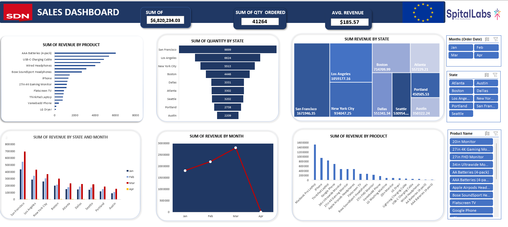
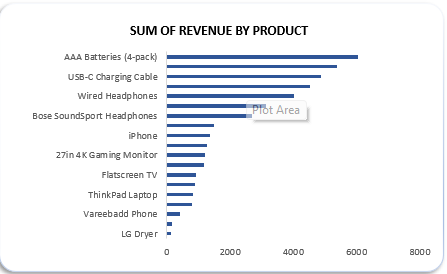

# Sales-Analysis
## by Kola Ademola
___
## INTRODUCTION
___
In this project I did this ..............
___
### SKILLS DEMONSTRATED
___
* Used complex excel formulas to clean and analyze data
* Used Pivot tables and slicers to create a dynamic dashboard
___
### ANALYSIS & VISUALIZATIONS
___
I createdd this business dashboard;  

* What is the total rev by products?  

> INSIGHT: AAA battery is generating the most revenue.
___
### RECOMMENDATIONS & CONCLUSIONS
___
* do this
* do that etc...
